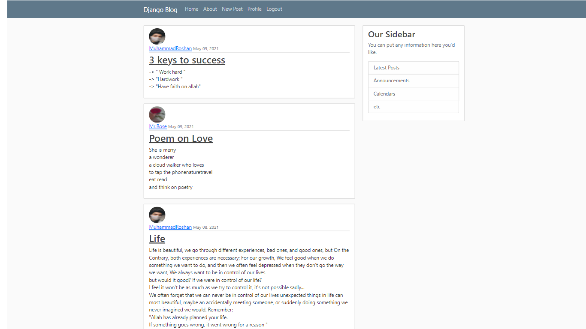

# My_Django_blog
"In this project I have made a blog with Django framework and it is my first Django project with the help of tutorial but I have added will add additional features as I gain more knowledge  "

here is the preview:

